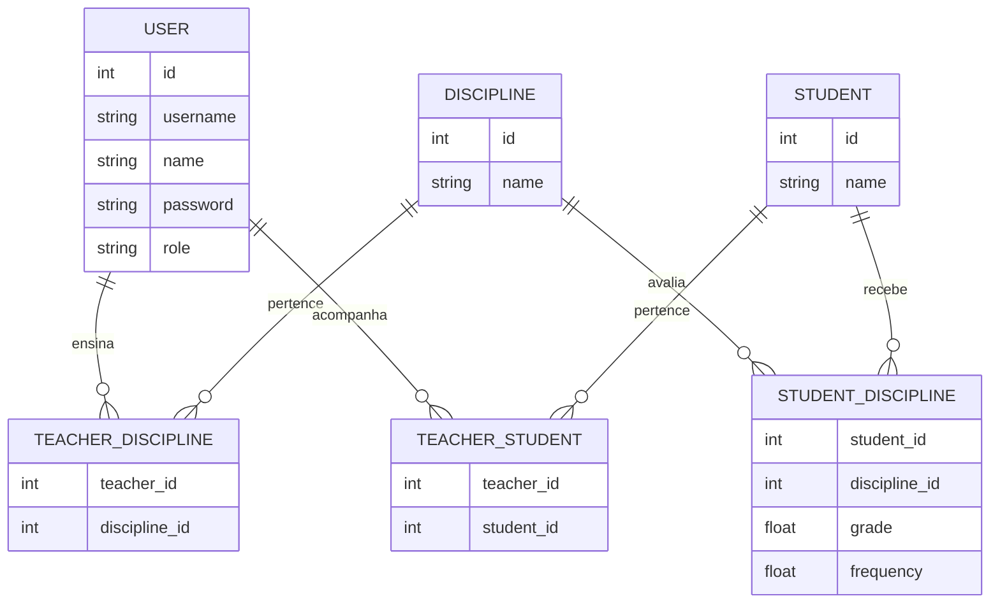

# Sistema de Gerenciamento de Notas e Frequência - Student System

[](https://www.dtidigital.com.br/)

## Descrição
Este é um projeto avaliativo da empresa **dti digital**, com o objetivo de avaliar a lógica de pensamento na resolução de um determinado problema.

---

## Contextualização
### Instruções Gerais

- Utilizar React na construção do front end (desejável)
- O uso de bibliotecas auxiliares é permitido (ex.: estilizações).
- Contudo, a lógica principal do teste deve ser implementada
inteiramente por você.
- Testes unitários são opcionais.
- O back end poderá ser implementado utilizando qualquer
linguagem/framework.

### O que deve ser enviado

- Link do repositório onde o código está hospedado (qualquer uma das
seguintes plataformas poderá ser usada: Github, Gitlab ou Bitbucket)
- O projeto deverá ter um arquivo README, contendo:
	- Instruções para executar o sistema
	- Lista de premissas assumidas
	- Decisões de projeto
	- O que mais você achar importante compartilhar sobre o projeto

### O problema

Carlos é um professor que precisa organizar as notas
e a frequência de seus alunos. Cada aluno tem uma
nota para cada uma das cinco disciplinas que Carlos
ensina e um registro de presença para cada aula.
Crie um sistema onde Carlos possa inserir as notas
de cada aluno (0 a 10) nas cinco disciplinas e a
frequência de cada aluno em percentual (0 a 100%). O
sistema deve calcular automaticamente a média das
notas de cada aluno, a média da turma em cada
disciplina e a frequência geral de cada aluno.
Além disso, o sistema deve permitir que Carlos veja
quais alunos têm uma média de notas acima da
média da turma e quais alunos têm uma frequência
abaixo de 75%, pois esses alunos precisam de atenção
especial.

<p align="center"><b>Entrada</b></p>

<Nome do aluno> <Nota da disciplina 1> <Nota da disciplina 2> <Nota da
disciplina 3> <Nota da disciplina 4> <Nota da disciplina 5>
<Frequência>
... (para cada aluno)

**Exemplo**

<pre>
João 7 8 6 9 10 80%
Maria 7 8 6 9 10 80%
</pre>

<p align="center"><b>Saída</b></p>

<Nome do aluno> <Média de notas do aluno> <frequência do aluno>
<Nome do aluno> <Média de notas do aluno> <frequência do aluno>
... (para cada aluno)
<média da turma em cada disciplina>
<lista de alunos com média acima da média da turma>
<lista de alunos com frequência abaixo de 75%>

**Exemplo**

<pre>
João 5 6 4 7 8 80%
Maria 7 8 6 9 10 70%
6 7 5 8 9
Maria
Maria
</pre>

(Imprima uma linha vazia se não houver alunos com média acima da média da turma ou
com frequência abaixo de 75%)

---

## Escopo do Projeto
Com base nesse contexto, a aplicação foi desenvolvida para o gerenciamento de notas e frequência de alunos. Ela permite que os professores organizem e acompanhem o desempenho dos alunos de forma prática, com foco na simplicidade de instalação e uso. Garantindo execução local sem complicações.

---

### Funcionalidades
-   Qualquer usuário pode visualizar os dados e suas análises sem precisar fazer login, recebendo a tag de **"Visitante"**. A desvantagem é que o sistema utiliza dados de todos os alunos da escola e os exibe sem privacidade.
-   Login de usuários com papéis distintos:
    -   **Admin**: Gerencia usuários (Admin e Professor), alunos (alterando nomes, adicionando ou excluindo) e disciplinas.
    -   **Professor**: Gerencia apenas os alunos e, com permissão para editar a tabela, pode adicionar, excluir e atualizar suas notas e frequência. Quando logado, a tabela exibe apenas os dados e informações de seus alunos.
- Cadastro e gerenciamento de:
  - Professores
  - Disciplinas
  - Alunos
  - Além das notas e da frequência de presença nas aulas
- Inserção e edição de notas (0 a 10) e frequência (0 a 100%) **por disciplina**.
- Cálculo automático:
  - Média de notas de cada aluno
  - Média da turma por disciplina
  - Frequência geral de cada aluno
- Identificação de alunos com:
  - Média acima da média da turma
  - Frequência abaixo de 75%
---

### Tecnologias Utilizadas

* Back-end em **Java com IntelliJ IDEA** e conceitos de **POO**
* Front-end em **JavaFX com SceneBuilder**
* Banco de dados relacional simplificado localmente.

---
### Mockups
#### Página Home


#### Página de Login


---

### Estrutura de Dados
Projeto foi utilizando o **H2 Database Engine** como banco de dados. A escolha foi feita por se tratar de um banco relacional leve e que pode ser executado de forma **embarcada na própria aplicação**, sem necessidade de instalação ou configuração de um servidor externo. Isso facilita a execução do projeto em outras máquinas, reduzindo etapas de configuração.

#### Diagrama de relacionamento


---

## Como Executar o Projeto
### Pré-requisitos
Para executar o sistema é necessário possuir os seguintes requisitos instalados no ambiente:
-   **Java Development Kit (JDK) 17**
-   **JavaFX** compatível com a versão do Java utilizada
-   **Git** (opcional, apenas para clonar o repositório)
-   Sistema operacional **Windows**
Não é necessário instalar ou configurar o banco de dados, pois ele é iniciado automaticamente junto com a aplicação.

### Instruções para Executar
1. **Clonar o repositório**

```bash
git clone https://github.com/o0andrefelipe0o/student-system
```

2.  **Acessar a pasta do projeto**

```bash
cd student-system
```

3.  **Abrir o projeto em uma IDE Java**
O projeto pode ser aberto em IDEs como:
-   IntelliJ IDEA
-   Eclipse
-   NetBeans

4.  **Executar a aplicação**
Localize a classe principal do projeto e execute-a pela IDE.

```
student-system\src\main\java\com\dev\studentsystem\MainApp.java
```

A aplicação iniciará e automaticamente  abrirá a interface gráfica.

#### Usuários para Login
##### Usuário (Carlos)

ID de login:
```
carlos
```
Senha:
```
@A#70
```
##### Usuário (Admin)

ID de login:
```
admin
```
Senha:
```
admin
```

---

**Projeto desenvolvido exclusivamente para fins avaliativos.**

---

## Autor

**André Felipe de Moraes**

* LinkedIn: [https://www.linkedin.com/in/o0andrefelipe0o/](https://www.linkedin.com/in/o0andrefelipe0o/)

* GitHub: [https://github.com/o0andrefelipe0o/](https://github.com/o0andrefelipe0o/)
